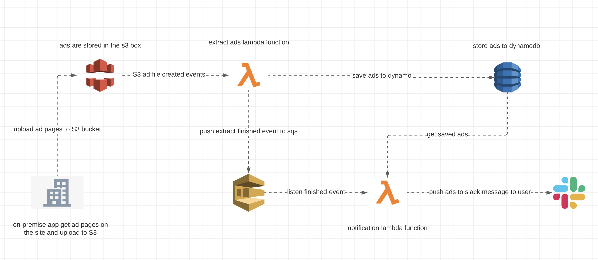

# Sahibindex

A simple serverless stack application to pull ads from sahibinden.com and send them over slack
lazy developer app :smiley:

## Getting Started

The application scraps the web pages it has received from the s3 bucket and writes the ad information it obtained into dynamodb, then leaves a message with sqs and informs the user via slack.
### architecture

sample stack diagram

## Deployment

* create the s3 input bucket, which will be the trigger for the function extract.
* create sqs queue, which will be the trigger for the function notification.
* create dynamodb table wth primary key is adId
* deploy extract lambda function with TABLE_NAME and SQS_QUEUE_URL env variables
* deploy notification function with TABLE_NAME, SLACK_TOKEN and SLACK_USER via user email

sample s3 bucket input file example is -> [samplesS3input.html](sampleS3input.html)
